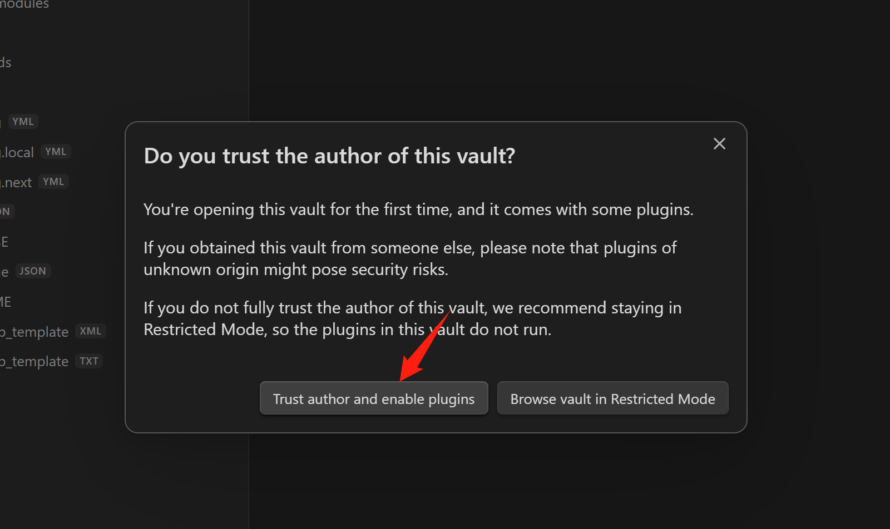
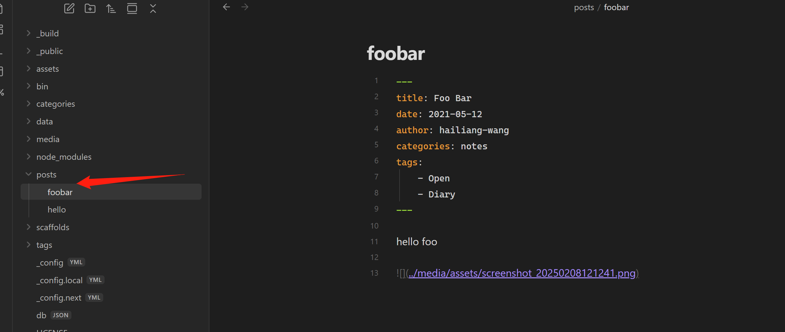
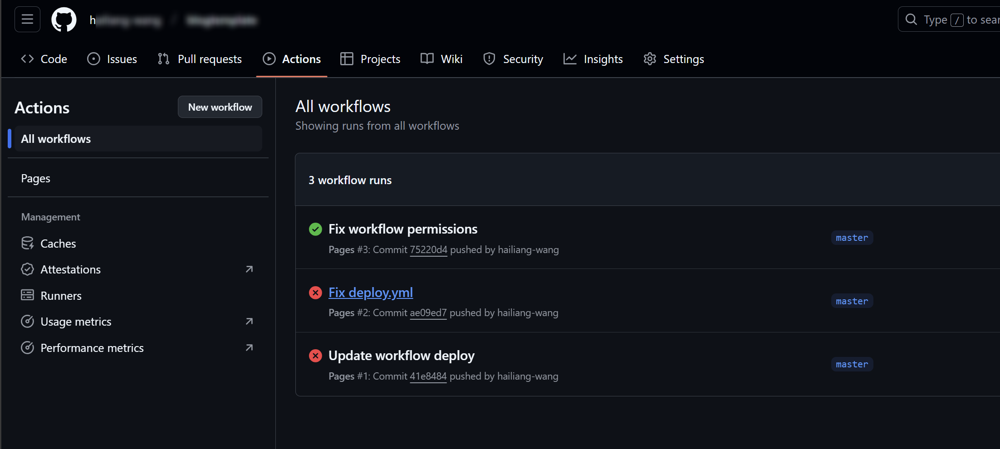
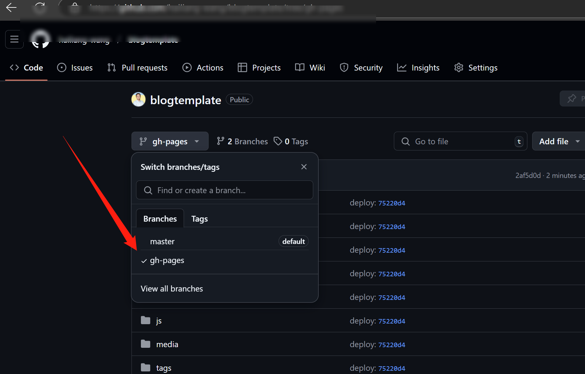
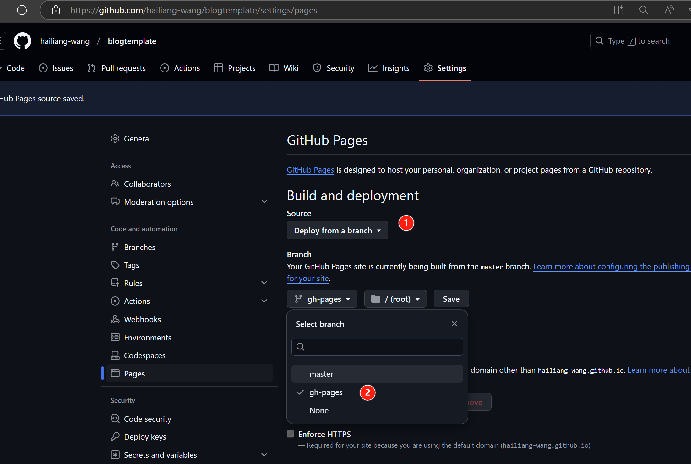
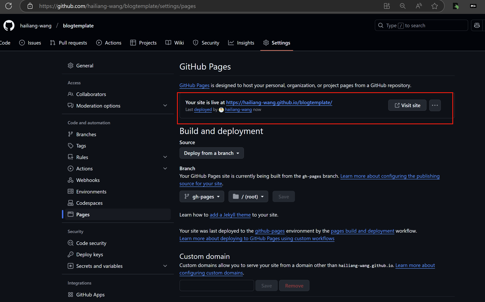
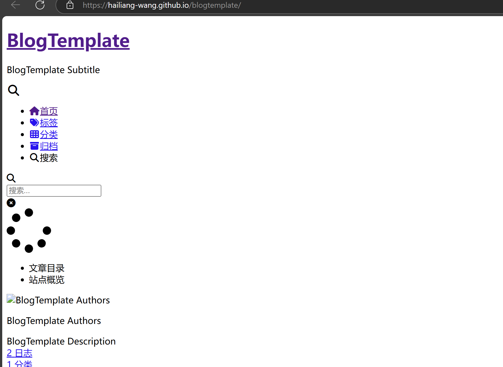
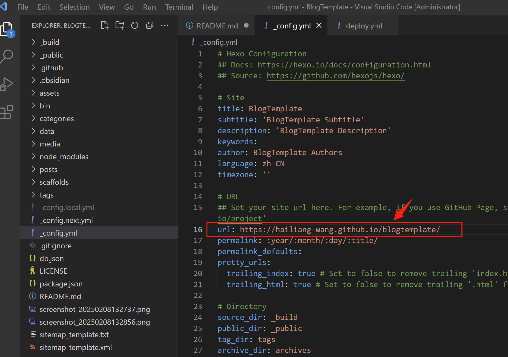
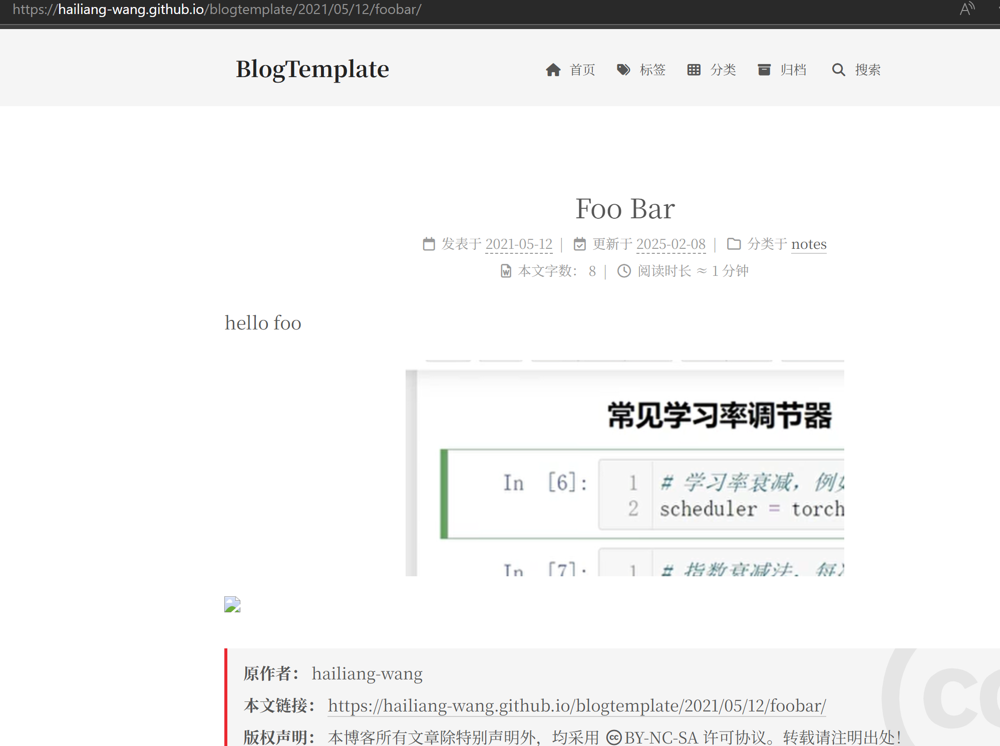

# BlogTemplate

* Host blogs with GitHub
* Write with Obsidian

## Fork and clone

1) Fork github repo: [https://github.com/hailiang-wang/blogtemplate](https://github.com/hailiang-wang/blogtemplate)

2) Clone your own repo.

```
git clone git@github.com:$YOUR_NAME/blogtemplate.git
```

Optional: modify your project name, such as `blogs`, later the project name would be used as part of URL in GitHub Pages Service.

## Add note with Obsidian

> ROOT_DIR, root dir, path cloned for BlogTemplate.

1. Install Obsidian, Git Bash, NodeJS

2. Copy obsidian vault

```
cd $ROOT_DIR
cp -rf assets/_obsidian .obsidian
```

3. Open root dir as vault in Obsidian


Enable all plugins.



4. Add new note in `posts`, e.g. `posts/hello.md`



Note -

* No spaces are allowed in note file name

## Build and serve locally

### Build

Open in Git Bash, cd to $ROOT_DIR

```
cd $ROOT_DIR
npm install 
./bin/build.sh
```


### Serve

```
cd $ROOT_DIR
./bin/dev.sh
```

## FAQs

### How to write in markdown

https://hexo.io/docs/writing

### More config on hexo

https://hexo.io/docs/configuration

### How to publish blogs

After pushed updates into GitHub, GitHub would fire publish jobs with your configurations.

More about GitHub Token, [link](https://docs.github.com/en/actions/security-for-github-actions/security-guides/automatic-token-authentication#using-the-github_token-in-a-workflow).

If working properly, the actions are executed with every git push.

https://github.com/xxxx/blogtemplate/actions



The files under `gh-pages` are updated as well.



Set GitHub Page service, choose deploy from a branch.



After saving the options, refresh the page after two minutes or so, you would get the deployment result.



Now, visit and share your github page blog, you may see page like this -



Now, you need to change the `_config.yml` to fix the URL path issue, for example, you get your blog URL as https://hailiang-wang.github.io/blogtemplate/, navigate to `_config.yml` in VSCode.



Change `url` to `https://hailiang-wang.github.io/blogtemplate/`, then push to GitHub repo again, after the Actions Workflow is done, the blog website would look like this -



Well done.

## Others

* [markdown2word-doc-template](https://github.com/hailiang-wang/markdown2word-doc-template)


## License

[](http://creativecommons.org/licenses/by/4.0/)

This work is licensed under a [Creative Commons Attribution 4.0 International License](http://creativecommons.org/licenses/by/4.0/).

